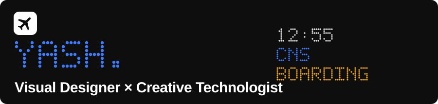
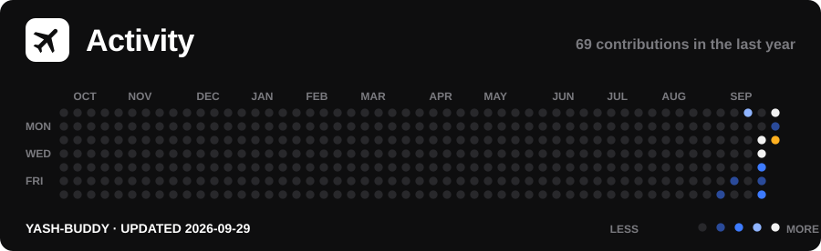

I work across visual design, information design, data visualization, and creative coding, turning complex information into clear, interactive visual experiences.

  

A living particle field that responds to pointer movement and scroll. Click the board to open it.

  

Portfolio · LinkedIn · Email
