# YASH. 🪖
### Visual Designer × Creative Technologist

I work across visual design, information design, data visualization, and
creative coding, turning complex information into clear, interactive
visual experiences.

---

### DESIGN
`Presentation Design` · `Information Design` · `Data Visualization` · `UI / UX`

### CODE
`React` · `JavaScript` · `D3.js` · `Canvas / WebGL` · `Creative Coding`

### PORTFOLIO

- → [Visual Instrument Portfolio](https://visual-instrument-portfolio.vercel.app) — a living particle field that responds to pointer movement and scroll

---

### FIND OUT MORE

[Portfolio](https://visual-instrument-portfolio.vercel.app) · 
## FIND OUT MORE

## FIND OUT MORE

